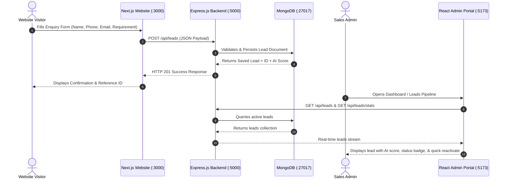

# 🚀 AI Lead Reactivator

An autonomous, full-stack lead recovery and reactivation suite that turns cold, dormant CRM leads into high-converting sales conversations.

---

## 🌟 System Architecture & Flow



---

## 📁 Project Structure

```
ai-lead-reactivator/
├── lead-reactivator-admin/      → React.js (Vite) Admin Command Center
│   ├── src/
│   │   ├── components/          → Sidebar, Header, LeadModal
│   │   ├── pages/               → Dashboard (KPIs, Funnel), Leads (Filters, Table)
│   │   ├── App.jsx              → Main State, Polling & CRUD Actions
│   │   ├── index.css            → Modern Dark Glassmorphic Design System
│   │   └── main.jsx
│   ├── package.json
│   └── vite.config.js
│
├── lead-reactivator-website/    → Next.js Modern Landing Page & Lead Capture
│   ├── src/
│   │   ├── app/
│   │   │   ├── layout.js        → Root Layout & Metadata
│   │   │   ├── page.js          → Landing Page with Hero & Features
│   │   │   └── globals.css      → Glows, Typography & Component Styling
│   │   └── components/
│   │       ├── Navbar.jsx       → Navigation & Quick Links
│   │       └── LeadForm.jsx     → Interactive Enquiry Form (POST to API)
│   └── package.json
│
├── lead-reactivator-backend/    → Node.js + Express.js REST API
│   ├── models/
│   │   └── Lead.js              → Mongoose Lead Schema with AI Scoring
│   ├── routes/
│   │   └── leadRoutes.js        → CRUD, Stats, & Reactivation Trigger Endpoints
│   ├── server.js                → Express Server & MongoDB Connection
│   ├── seed.js                  → Realistic Enterprise Demo Leads
│   ├── .env                     → Port & MongoDB URI
│   └── package.json
│
├── .gitignore                   → Excludes node_modules, build artifacts, & env
└── README.md                    → Project Overview & Setup Instructions
```

---

## ⚡ Quick Start Guide

### Prerequisites
- **Node.js**: v18+ (Tested on v24)
- **MongoDB**: Local MongoDB running on `mongodb://127.0.0.1:27017` or MongoDB Atlas URI

---

### 1. Start the Backend API (:5000)

```bash
cd lead-reactivator-backend

# Install dependencies
npm install

# (Optional) Seed realistic demo leads
npm run seed

# Start server
npm start
# Output:
# ✅ Connected to MongoDB successfully at mongodb://127.0.0.1:27017/ai-lead-reactivator
# 🚀 Server running on http://localhost:5000
```

---

### 2. Start the Public Website (:3000)

```bash
cd lead-reactivator-website

# Install dependencies
npm install

# Start Next.js development server
npm run dev
# Running on http://localhost:3000
```

---

### 3. Start the Admin Portal (:5173)

```bash
cd lead-reactivator-admin

# Install dependencies
npm install

# Start Vite React development server
npm run dev
# Running on http://localhost:5173
```

---

## 🔌 REST API Reference

Base URL: `http://localhost:5000/api/leads`

| Method | Endpoint | Description |
| :--- | :--- | :--- |
| `POST` | `/api/leads` | Create and save a new lead in MongoDB |
| `GET` | `/api/leads` | Fetch all leads (supports `?status=` and `?search=`) |
| `GET` | `/api/leads/stats` | Aggregate dashboard statistics (total, new, reactivated, conversion rate) |
| `GET` | `/api/leads/:id` | Fetch single lead details |
| `PATCH` | `/api/leads/:id` | Update lead status (`New`, `Contacted`, `Reactivated`, `Closed`) |
| `POST` | `/api/leads/:id/reactivate` | Trigger autonomous AI reactivation workflow |
| `DELETE` | `/api/leads/:id` | Delete a lead |

### Example POST Request

```bash
curl -X POST http://localhost:5000/api/leads \
  -H "Content-Type: application/json" \
  -d '{
    "name": "Jordan Bell",
    "phone": "+1 (555) 902-1829",
    "email": "jordan.bell@acme.corp",
    "requirement": "Need AI reactivation flow for 3,000 cold leads from Q4 CRM export"
  }'
```

---

## 🧪 End-to-End Flow Verification

1. **Step 1**: Open Public Website at [`http://localhost:3000`](http://localhost:3000).
2. **Step 2**: Scroll down to the **Submit Lead Inquiry** form.
3. **Step 3**: Fill in Name, Phone, Email, and Requirement, then click **Submit Lead Inquiry**.
4. **Step 4**: The inquiry is sent to Express (`POST /api/leads`) and saved in MongoDB.
5. **Step 5**: Open Admin Portal at [`http://localhost:5173`](http://localhost:5173).
6. **Step 6**: The lead instantly appears in the **Recent Leads Live Stream** on the Dashboard and under the **Leads Pipeline** table with its calculated AI engagement score and live status actions!
